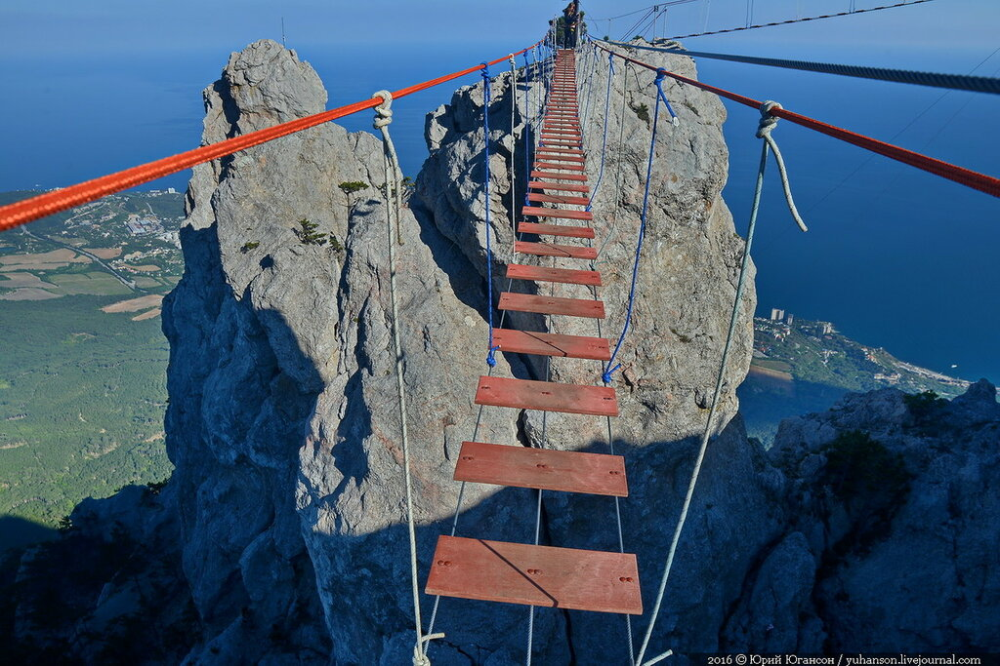
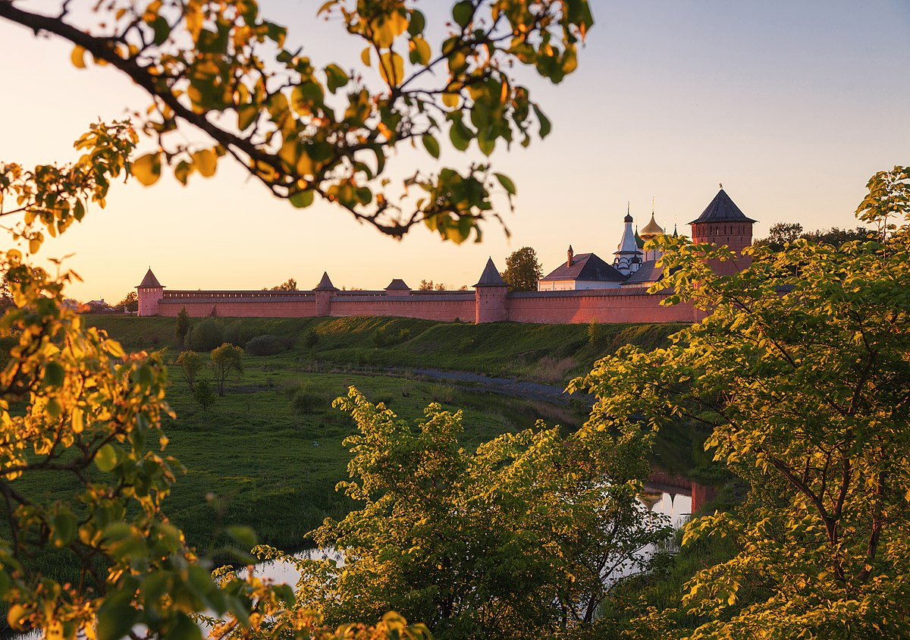

# Путешествия по России с Суховым Александром =)

Первое место куда мы отправимся это ## Ялта

Вы на вершине 1234 метра, а внизу, как на ладони, почти все южное побережье Крыма. Гора Ай-Петри —  самое посещаемое в Ялте место. Летом здесь всегда много туристов, которые задерживаются до захода солнца, чтобы полюбоваться на ночные огни полуострова.

Второе сесто это ## Сочи

Гора Роза Пик это самая красивая и знаменитая возвышенность курорта. Высота ее составляет 2320 метров. Туристы поднимаются на вершину с помощью закрытого фуникулёра. Круглый год она покрыта снегом и ледниками. Летом местами пробиваются цветы и травы.

Третье место это ## Суздаль

Суздаль это музей под открытым небом, «заповедник» богатой истории и памятник нашей культуры. Здесь несколько сотен церквей, монастырей и других достопримечательностей, которые сохранились до наших дней. Пять из них включены в список мирового культурного наследия ЮНЕСКО.